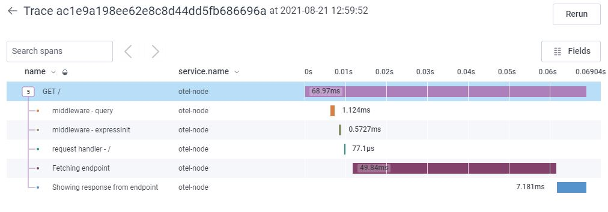

# otel-node

This is a basic node app that fetches an endpoint to return a word (otel) and description (open telemetry). It is instrumented with open telemetry, sending trace data to Honeycomb

## to run

- Clone repo locally, `cd` into directory, and run `npm install`
- add `.env` file with environment variables for `HONEYCOMB_API_KEY` and `HONEYCOMB_DATASET` (do not check into git, it's ignored by default in `.gitignore`). Follow `.sample.env` file for guidance.
- `npm start` to start app, ensure console shows '`Example app listening at http://localhost:3000`' and '`Tracing initialized`'.
- `curl localhost:3000` at command line, GET localhost:3000 in Insomnia or other rest client, or visit localhost:3000 in browser and see "word: otel description: open telemetry"
- check honeycomb for trace

